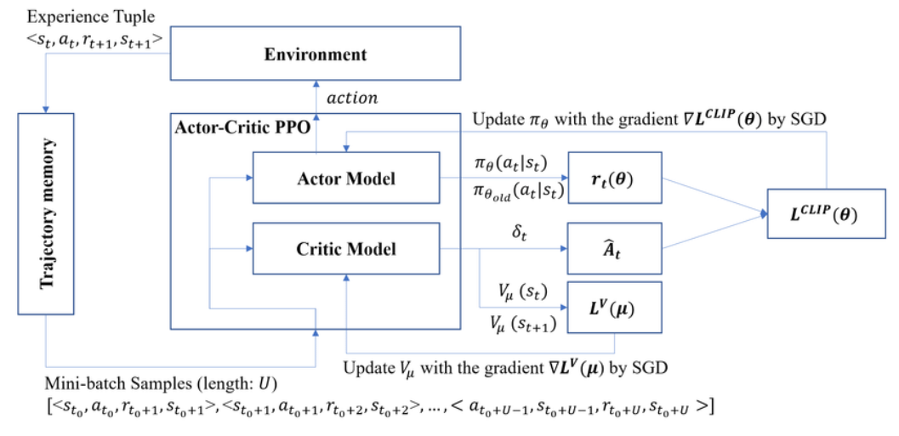

# PPO Discrete

## Overview

This repository contains an implementation of the Proximal Policy Optimization (PPO) algorithm for discrete action spaces. PPO is a reinforcement learning algorithm introduced by OpenAI to improve the training stability and performance of policy gradient methods.

For a detailed understanding of PPO, you can refer to the original research paper by Schulman et al.:
[Proximal Policy Optimization Algorithms](https://arxiv.org/abs/1707.06347).

To learn more about PPO and its applications, visit this [Hugging Face blog post](https://huggingface.co/blog/deep-rl-ppo).

## Architecture

*Image credit: [ResearchGate](https://www.researchgate.net/figure/The-actor-critic-proximal-policy-optimization-Actor-Critic-PPO-algorithm-process_fig3_339651408)*
